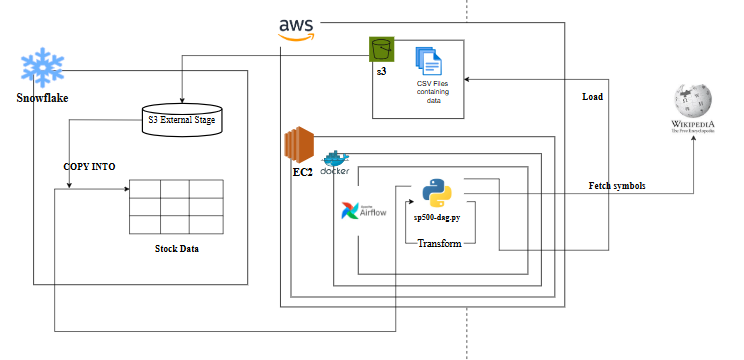
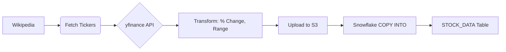

```markdown
# Daily S&P 500 ETL Pipeline: Airflow → S3 → Snowflake  

**Automated daily extraction, transformation, and loading of S&P 500 stock data using Apache Airflow, AWS S3, and Snowflake.**



---

## Overview

This project runs a **fully automated daily ETL pipeline** that:

1. **Scrapes** the latest S&P 500 constituents from Wikipedia  
2. **Fetches** real-time OHLCV data for all ~500+ tickers using `yfinance`  
3. **Transforms** the data (adds % change, daily range, etc.)  
4. **Uploads** cleaned CSV to **AWS S3**  
5. **Loads** into **Snowflake** via external stage for analytics  

> **Schedule**: `@daily` (runs every day at midnight UTC)  
> **Tech Stack**: Airflow, Python, pandas, yfinance, AWS S3, Snowflake, Docker Compose

---

## Features

- Dynamic ticker list (always up-to-date with S&P 500 changes)
- Robust error handling per ticker
- Idempotent & fault-tolerant design
- Timestamped S3 paths for auditability
- Snowflake-ready schema with calculated metrics
- Deployed on **AWS EC2** with **Docker Compose**

---

## Project Structure

```
.
├── sp500-dag.py              # Airflow DAG (main pipeline)
├── snowflake_setup.txt       # Snowflake DDL (table, stage, roles)
├── commands.txt              # Full deployment & setup guide
├── docker-compose.yml        # (Assumed in deployment)
├── data/                     # Local temp storage (Docker volume)
└── README.md                 # You're here!
```

---

## Pipeline Flow



---

## Snowflake Schema

```sql
AIRFLOW_DATA.airflow.STOCK_DATA
```

| Column             | Type   | Description |
|--------------------|--------|-----------|
| `DATE`             | DATE   | Trading date |
| `SYMBOL`           | STRING | Ticker (e.g., AAPL) |
| `OPEN`, `HIGH`, `LOW`, `CLOSE` | FLOAT | Price data |
| `ADJ_CLOSE`        | FLOAT  | Adjusted close |
| `VOLUME`           | FLOAT  | Trading volume |
| `CLOSE_CHANGE`     | FLOAT  | Daily price delta |
| `CLOSE_PCT_CHANGE` | FLOAT  | % change from prev close |
| `DAILY_RANGE`      | FLOAT  | High - Low |
| `DAILY_RANGE_PCT`  | FLOAT  | (High-Low)/Close * 100 |

---

## Setup & Deployment

### Prerequisites

- AWS Account (S3 + EC2)
- Snowflake Account
- Docker & Docker Compose
- Python 3.9+
- Access to `yfinance`, `pandas`, `beautifulsoup4`

---

### Step-by-Step Deployment (EC2 + Docker)

1. **Launch EC2 Instance**
   - Type: `t2.xlarge` (recommended)
   - Storage: 30+ GB
   - Open ports: `22`, `8080`, `4000-38888`

2. **Attach IAM Role**
   - `AmazonS3FullAccess`
   - `AmazonEC2FullAccess` (or custom policy)

3. **SSH into EC2**
   ```bash
   ssh -i your-key.pem ec2-user@your-ec2-public-dns
   ```

4. **Install Docker & Compose**
   ```bash
   sudo yum update -y
   sudo yum install docker -y
   sudo curl -L "https://github.com/docker/compose/releases/download/1.29.1/docker-compose-$(uname -s)-$(uname -m)" -o /usr/local/bin/docker-compose
   sudo chmod +x /usr/local/bin/docker-compose
   sudo gpasswd -a $USER docker
   newgrp docker
   ```

5. **Create `.env`**
   ```bash
   echo -e "AIRFLOW_UID=50000" > .env
   ```

6. **Start Airflow**
   ```bash
   docker-compose up -d --build
   ```

7. **Access Airflow UI**
   - [http://localhost:8080](http://localhost:8080) (port-forwarded)
   - Default: `admin` / `admin`

---

### Configure Connections in Airflow

#### 1. AWS S3
- **Conn ID**: `aws_access_keys`
- **Type**: Amazon Web Services
- **Access Key ID** & **Secret Access Key**

#### 2. Snowflake
- **Conn ID**: `snowflake_conn`
- **Type**: Snowflake
- **Login**: `AIRFLOW_USER`
- **Password**: `airflow` (or your secure password)
- **Account**: `your-account.us-west-2`
- **Warehouse**: `COMPUTE_WH`
- **Database**: `AIRFLOW_DATA`
- **Schema**: `airflow`
- **Role**: `AIRFLOW_ROLE`

---

### Snowflake Setup

Run the SQL in `snowflake_setup.txt`:

```sql
CREATE WAREHOUSE IF NOT EXISTS COMPUTE_WH;
CREATE ROLE IF NOT EXISTS AIRFLOW_ROLE;
CREATE USER IF NOT EXISTS AIRFLOW_USER ...;
CREATE OR REPLACE DATABASE AIRFLOW_DATA;
CREATE SCHEMA airflow;
CREATE OR REPLACE TABLE STOCK_DATA (...);
```

> Don’t forget to create the **external stage** pointing to your S3 bucket!

```sql
CREATE OR REPLACE STAGE STOCKS_STAGE
  URL = 's3://sp500-affan-bucket/stock/'
  CREDENTIALS = (
    AWS_KEY_ID = 'your-key'
    AWS_SECRET_KEY = 'your-secret'
  );
```

---

## Debugging Tips (Learned the Hard Way)

| Issue | Fix |
|------|-----|
| `Permission denied` on `/home/ec2-user/` | `sudo chown -R ec2-user:ec2-user /home/ec2-user/` |
| Docker volume resets | Always run after `docker-compose down` |
| `yfinance` fails for some tickers | Wrapped in `try/except` per symbol |
| Wikipedia column name changes | Dynamic check: `"Symbol" if "Symbol" in df.columns else "Ticker"` |
| S3 stage not found | Double-check stage name & URL in Snowflake |
| XCom not found | Use `ti.xcom_pull(task_ids="...", key="...")` |

> **Pro Tip**: Use **port forwarding** to debug locally:
> ```bash
> ssh -L 8080:localhost:8080 ec2-user@your-ec2
> ```

---

## Trigger the DAG

1. Go to Airflow UI → DAGs → `sp500_yfinance_to_s3_to_snowflake`
2. Click **Trigger DAG**
3. Monitor logs in real-time

---

## Future Enhancements

- [ ] Add email/Slack alerts on failure
- [ ] Backfill historical data
- [ ] ML model for anomaly detection
- [ ] Dashboard with Streamlit/Looker
- [ ] Use Snowflake tasks instead of Airflow for loading

---

## Author

**Affan**  
Data Engineer  

[](https://linkedin.com/in/m-affan-bin-aamir-338245334)  
[](https://github.com/Afffan16)

---

## Star this repo if you found it useful! 🌟

> *"The pipeline works. The bugs don't."* – Me, after 47 `docker-compose down && up`

---
```
